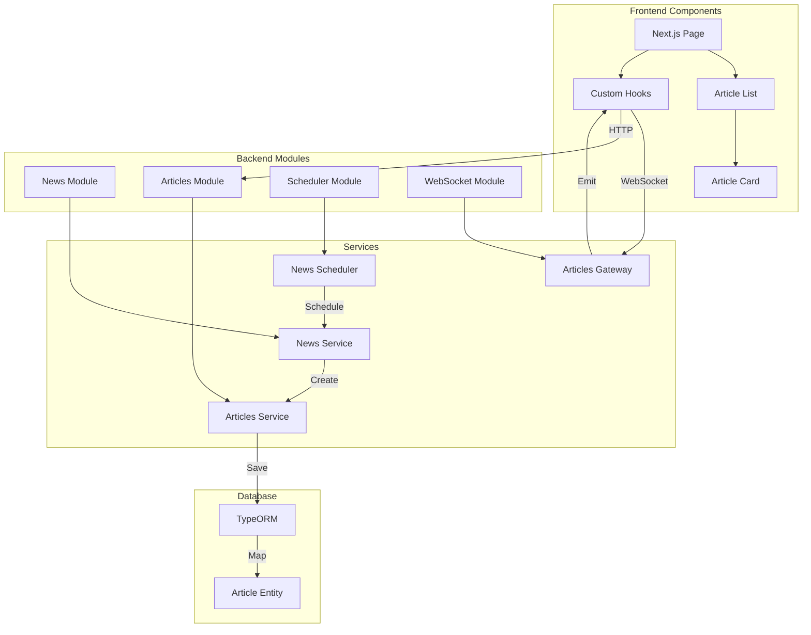

# Component Interaction Diagram

## Component Details

1. **Frontend Components**
   - `Page`: Next.js pages for routing and layout
   - `ArticleList`: Main component for displaying articles
   - `ArticleCard`: Individual article display
   - `Hooks`: Custom hooks for data fetching and real-time updates

2. **Backend Modules**
   - `NewsModule`: Handles news fetching and processing
   - `ArticlesModule`: Manages article storage and retrieval
   - `SchedulerModule`: Manages scheduled tasks
   - `WebSocketModule`: Handles real-time updates

3. **Services**
   - `NewsService`: Fetches articles from News API
   - `ArticlesService`: CRUD operations for articles
   - `NewsScheduler`: Schedules periodic article updates
   - `ArticlesGateway`: WebSocket gateway for real-time updates

4. **Database**
   - `ArticleEntity`: TypeORM entity for articles
   - `TypeORM`: Database ORM for SQLite 