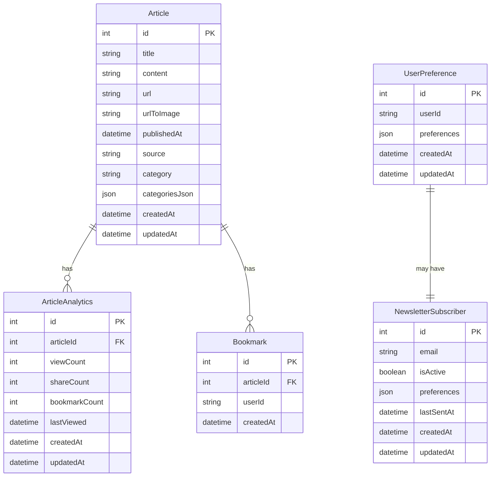

# Database Schema

## Entity Descriptions

### Article
- Primary entity storing news articles
- Contains core article data (title, content, URL)
- Tracks source and categories
- Includes metadata like publishing date

### UserPreference
- Stores user-specific settings
- Preferences stored as JSON for flexibility
- Can include theme, view preferences, etc.

### ArticleAnalytics
- Tracks engagement metrics for articles
- Counts views, shares, and bookmarks
- Links to parent article via foreign key

### NewsletterSubscriber
- Manages newsletter subscriptions
- Stores email and subscription status
- Includes delivery preferences and history

### Bookmark
- Represents saved articles
- Links users to articles
- Tracks when bookmarks were created

## Relationships
1. One Article can have many ArticleAnalytics records
2. One Article can have many Bookmarks
3. UserPreference may be associated with one NewsletterSubscriber
4. Each Bookmark belongs to one Article and one User

## Notes
- All tables include timestamps (createdAt, updatedAt)
- Foreign keys ensure referential integrity
- JSON fields allow for flexible schema evolution
- Indexes should be added on frequently queried fields 