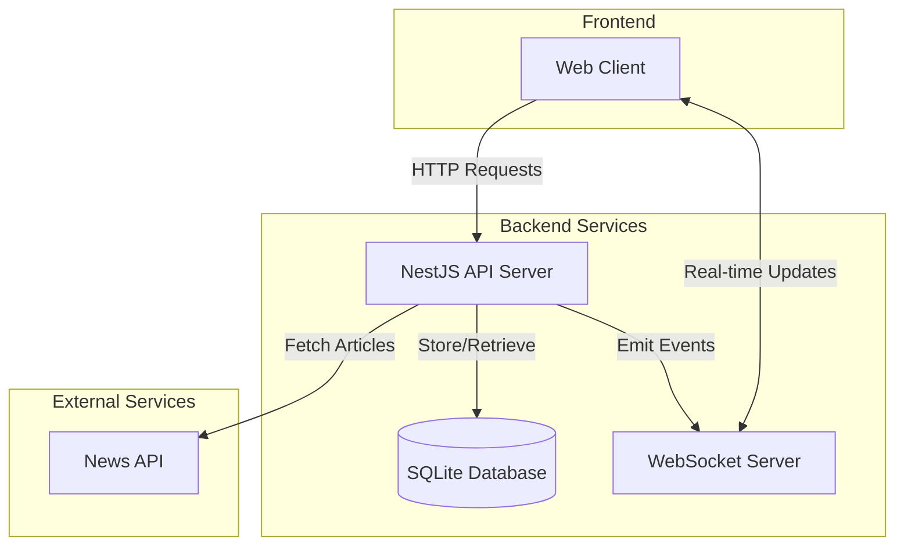

# System Architecture

## Description

The system consists of three main components:

1. **Frontend**
   - React-based web client
   - Real-time updates via WebSocket
   - Server-side rendering with Next.js

2. **Backend Services**
   - NestJS API server for REST endpoints
   - WebSocket server for real-time updates
   - SQLite database for article storage
   - Scheduled tasks for article fetching

3. **External Services**
   - News API for fetching latest articles 